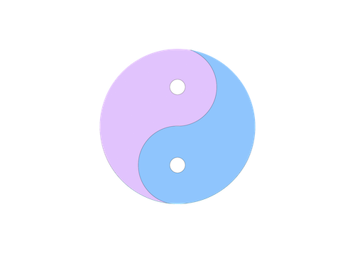

# ImageMorpher
* This application exposes a public API for morphing two faces together

* The iOS app built with React Native: https://github.com/osamja/imagemorpher-mobile

# Build the container
- Create a .env file in the imagemorpher directory where settings.py is located.  Populate the secret key variable by running `python manage.py shell -c 'from django.core.management import utils; print(utils.get_random_secret_key())'`

- The docker build can take 10-15 min, so you may start a screen session while building `screen -S build-morpher`
   
- Build the docker image: `docker build --memory=2g --memory-swap=4g --cpuset-cpus=1 -t face-morpher-api:<RELEASE-VERSION> -f Dockerfile .`

## Debug a container

- Bash into the container: `docker-compose -f docker-compose.yml run --rm face-morpher-api /bin/bash`
- Start the development server: `python manage.py runserver 0:8000`
